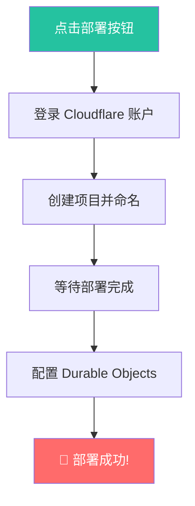
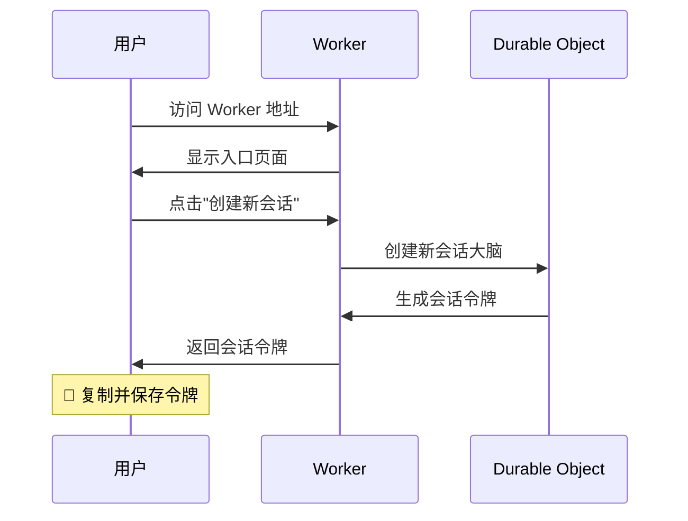
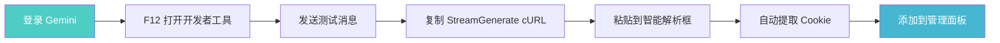
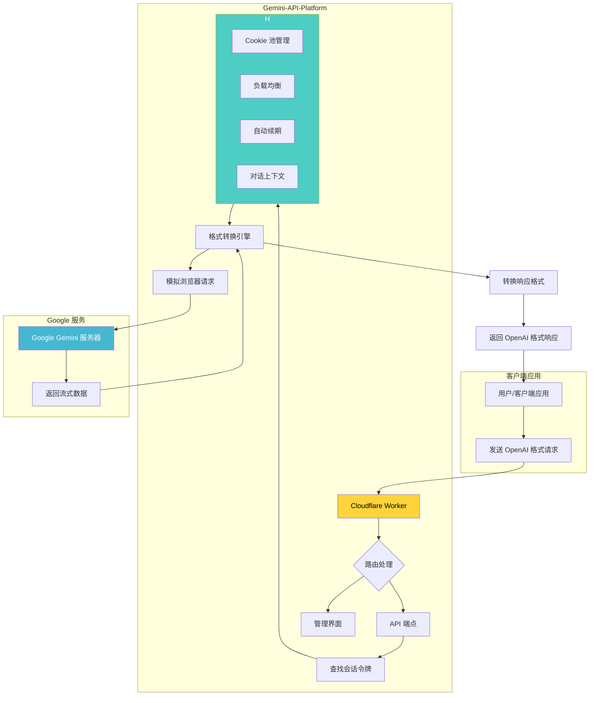
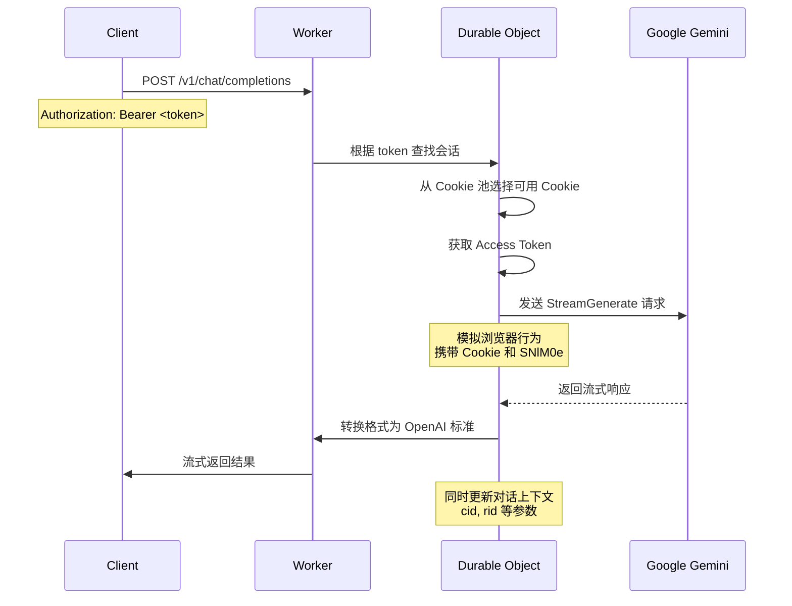
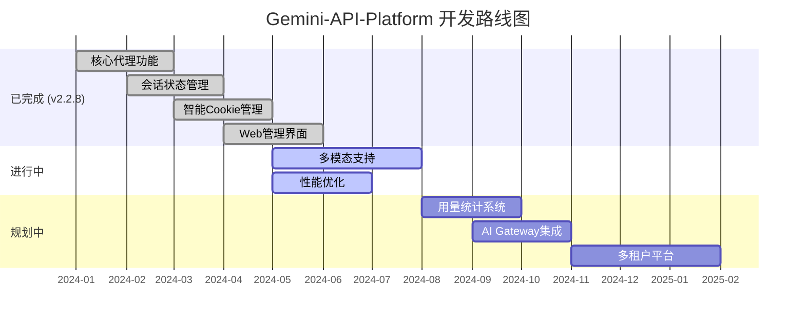

# 目前主要是因为cfwork平台的ip被google已经先行拉黑了，所以导致429，您可以把工作流等等通过AI转为你需要的语言即可


# Gemini-API-Platform-CFWork 🚀


[](https://deploy.workers.cloudflare.com/?url=https://github.com/lza6/gemini-api-platform-cfwork)


**一个完全自包含、一键部署、将 Google Gemini 网页版转化为 OpenAI 格式 API 的 Cloudflare Worker 平台。**

> 👨‍🚀 **F1 驾驶舱开发哲学**：我们坚信，强大的工具应该像 F1 赛车的驾驶舱——对新手而言，它清晰地展示了最关键的仪表；对专家而言，它提供了深入调校每一个参数的可能性。本项目旨在为所有人提供一个既简单上手又充满潜力的 Gemini API 平台。你，就是那位王牌车手！

---

## ✨ 项目亮点与核心特性

<div align="center">

| 特性 | 描述 | 状态 |
|------|------|------|
| 🔑 **零成本部署** | 基于 Cloudflare 免费套餐，无需服务器和域名 | ✅ 已实现 |
| 🚀 **一键部署** | 3分钟内完成部署，全程图形化操作 | ✅ 已实现 |
| 🤖 **OpenAI 格式兼容** | 无缝转换为 `v1/chat/completions` 格式 | ✅ 已实现 |
| 🧠 **会话状态保持** | 基于 Durable Objects 的智能会话管理 | ✅ 已实现 |
| 🍪 **智能 Cookie 管理** | 自动续期、负载均衡、智能解析 | ✅ 已实现 |
| 🛡️ **强大的稳定性** | 模拟真实浏览器行为，规避风控 | ✅ 已实现 |
| 🌐 **自带管理面板** | 直观的 Web UI，轻松管理所有配置 | ✅ 已实现 |

</div>

---

## 🤔 这个项目解决了什么痛点？

**一句话：让普通用户也能像开发者一样，稳定、免费、便捷地使用强大的 Gemini 模型。**

Google Gemini 是一个出色的对话式 AI，但缺乏公开易用的免费 API，导致：

- ❌ **无法集成**：不能接入第三方应用和客户端
- ❌ **操作繁琐**：每次都要打开网页手动操作
- ❌ **不便分享**：无法安全地分享给他人使用

**`Gemini-API-Platform` 就是你的解决方案！** 它像一个"转换插头"，将浏览器会话转换为标准的 API 接口。

---

## 🚀 懒人一键部署教程

这是最简单、最快的方式，全程图形化界面！

<div align="center">

### 🎯 点击下方按钮，即刻启程！

[](https://deploy.workers.cloudflare.com/?url=https://github.com/lza6/gemini-api-platform-cfwork)

</div>

### 📋 部署步骤详解



1. **点击按钮** → 点击 "Deploy to Cloudflare" 按钮
2. **授权登录** → 登录你的 Cloudflare 账户
3. **创建项目** → 为项目起名（如 `my-gemini-api-123`）
4. **后台配置** → 在 Durable Objects 中执行迁移操作
5. **部署完成** → 🎉 你的 API 平台已上线！

访问地址：`https://<你的项目名称>.<你的CF子域>.workers.dev`

---

## 📖 详细使用指南

### 第 1 步：创建专属会话

<div align="center">



</div>

1. 访问你的 Worker 地址
2. 点击 **"创建新会话"**
3. **复制并妥善保管**生成的会话令牌（这就是你的 API Key）

### 第 2 步：获取并添加 Cookie

<div align="center">



</div>

**智能获取 Cookie 方法：**

1. **打开开发者工具**：在 Chrome/Edge 中按 `F12`
2. **发送消息**：访问 `gemini.google.com` 并发送任意消息
3. **复制 cURL**：找到 `StreamGenerate` 请求，右键 → 复制为 cURL
4. **智能解析**：将内容粘贴到管理页面的"智能粘贴"框
5. **自动填充**：系统会自动提取关键 Cookie 值
6. **完成添加**：点击"添加 Cookie"按钮

### 第 3 步：在第三方应用中使用

**配置信息：**
- **API 端点**：`https://<你的项目名称>.<你的CF子域>.workers.dev/v1`
- **API 密钥**：你的会话令牌
- **模型名称**：`gemini-pro`, `gemini-1.5-pro-latest` 等

**示例代码：**
```bash
curl --location 'https://my-gemini-api-123.workers.dev/v1/chat/completions' \
--header 'Content-Type: application/json' \
--header 'Authorization: Bearer <你的会话令牌>' \
--data '{
    "model": "gemini-pro",
    "messages": [
        {
            "role": "user",
            "content": "你好，你是谁？"
        }
    ],
    "stream": true
}'
```

---

## 🔬 技术原理与架构设计

### 🏗️ 整体架构蓝图

<div align="center">



</div>

### 🔧 核心技术组件解析

<div align="center">

| 技术组件 | 🎯 作用 | 🧠 技术原理 | ⭐ 重要度 | 🔮 扩展方向 |
|---------|---------|-------------|-----------|-------------|
| **Cloudflare Workers** | 无服务器运行环境 | 按需执行代码，无需管理基础设施 | ★★★★★ | 集成更多 CF 服务 |
| **Durable Objects** | 会话状态管理 | 强一致性有状态存储，每个会话独立"大脑" | ★★★★★ | 复杂会话逻辑 |
| **`alarm()` 方法** | 自动续期机制 | 内置定时唤醒，自动刷新 Cookie | ★★★★☆ | 智能调度策略 |
| **TransformStream** | 实时数据转换 | 流式处理，同声传译式格式转换 | ★★★★★ | 中间件处理层 |
| **智能解析引擎** | Cookie 提取 | 从 cURL/HAR 自动解析关键参数 | ★★★★☆ | 更多格式支持 |

</div>

### 🔄 请求处理流程

<div align="center">



</div>

---

## 🏗️ 项目蓝图与未来发展

### 📁 项目结构

```
gemini-api-platform-cfwork/
├── 📄 wrangler.toml          # 项目配置和 Durable Objects 定义
├── 📄 worker.js              # 核心业务逻辑 (Worker 主文件)
├── 📄 package.json           # 项目依赖配置
└── 📄 README.md              # 项目文档
```

### 🎯 开发路线图

<div align="center">



</div>

### ✅ 已完成功能

- [x] **核心代理**：OpenAI 格式兼容的 API 代理
- [x] **会话管理**：基于 Durable Objects 的多会话隔离
- [x] **智能 Cookie**：自动续期、负载均衡、智能解析
- [x] **风控规避**：模拟真实浏览器 User-Agent
- [x] **管理界面**：完整的 Web UI 管理面板
- [x] **模型列表**：实现 `/v1/models` 接口

### 🚧 待开发功能

<div align="center">

| 功能模块 | 状态 | 优先级 | 技术挑战 |
|----------|------|--------|----------|
| 🖼️ **图片输入支持** | 规划中 | 🔴 高 | 图片上传接口集成 |
| 📊 **用量统计** | 规划中 | 🟡 中 | 数据持久化存储 |
| 🌐 **多区域部署** | 规划中 | 🟢 低 | Durable Objects 地理分布 |
| 👥 **多租户平台** | 长期规划 | 🟡 中 | 用户管理和计费系统 |

</div>

---

## ❓ 常见问题解答

<details>
<summary><strong>🔒 Q: 这个项目安全吗？我的 Google 账号会因此被封禁吗？</strong></summary>

**A:** 存在一定风险，但我们已尽力规避。项目通过模拟真实浏览器行为与 Google 服务器交互，v2.2.8 版本加入 `User-Agent` 模拟后大大降低了风险。**建议使用备用 Google 账号进行尝试。**
</details>

<details>
<summary><strong>🐛 Q: 部署成功但 API 调用失败怎么办？</strong></summary>

**A:** 90% 的问题出在 Cookie 上：
1. 检查 Cookie 是否正确添加（需要 `__Secure-1PSID` 和 `__Secure-1PSIDTS`）
2. 确认 Cookie 未过期（尝试重新获取）
3. 查看 Cloudflare Worker 日志获取详细错误信息
4. 确保网络可访问 `gemini.google.com`
</details>

<details>
<summary><strong>👥 Q: 可以分享 API 给朋友使用吗？</strong></summary>

**A:** 当然可以！只需要分享 **API 端点** 和 **会话令牌** 即可。请注意你们共享同一个会话和 Cookies，请确保朋友可信。
</details>

<details>
<summary><strong>🔄 Q: Cookie 多久需要更新一次？</strong></summary>

**A:** 系统会自动刷新 `PSIDTS` Cookie，通常可以维持较长时间。当 Cookie 失效时，系统会自动切换到其他可用 Cookie，你只需要定期检查管理面板中的 Cookie 状态。
</details>

---

## 📜 开源协议

本项目采用 **Apache License 2.0** 许可。

> 我们相信，代码的真正价值在于流动和演化。你的每一次 `fork`、`star` 和 `pull request` 都是在为这个世界注入新的可能性。

---

<div align="center">

### ⭐ 如果这个项目对你有帮助，请给我们一个 Star！

**仓库链接: [https://github.com/lza6/gemini-api-platform-cfwork](https://github.com/lza6/gemini-api-platform-cfwork)**

*让我们一起，站在巨人的肩膀上，看得更远。*

</div>

---

*文档最后更新：2025年11月21日 21:51:22 | 版本：v2.2.8*
